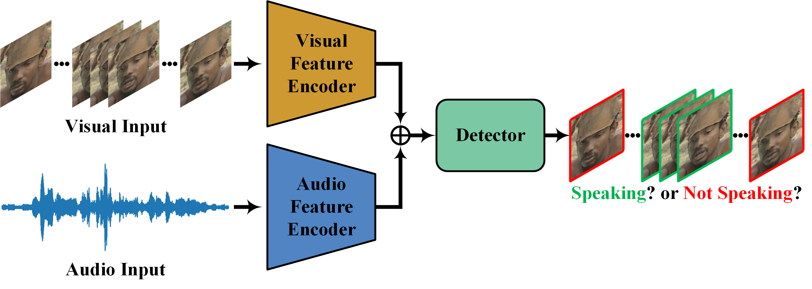
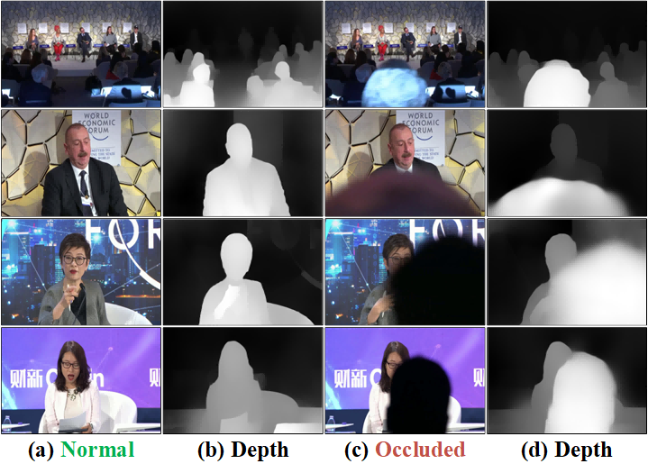
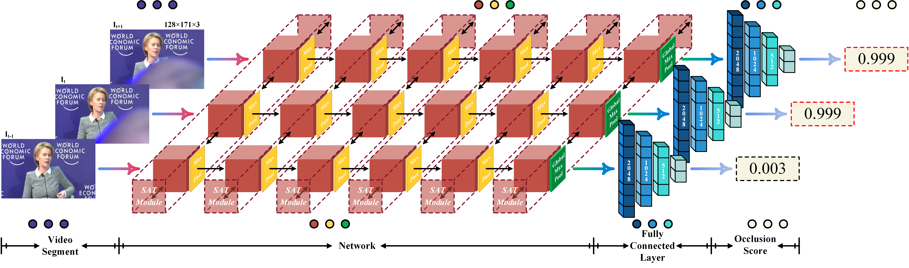
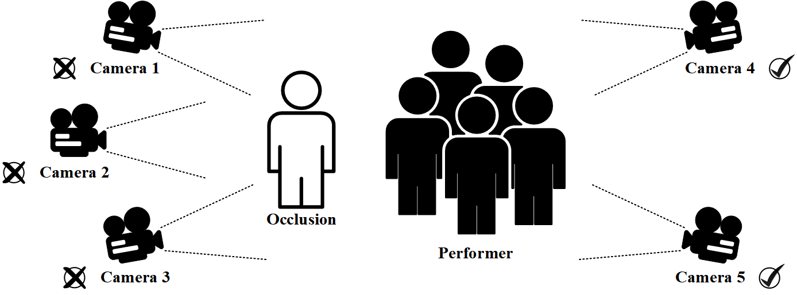

<h1> Hey! Nice to see you.</h1>

	
Welcome to my page!   I'm Junhua Liao, a Ph.D. candidate in <a href="http://cs.scu.edu.cn" target="_blank">College of Computer Science</a>, <a href="http://www.scu.edu.cn" target="_blank">Sichuan University</a> (SCU). I got my B.Eng. degree (2016-2020) from <a href="http://cs.scu.edu.cn" target="_blank">College of Computer Science</a>, <a href="http://www.scu.edu.cn" target="_blank">Sichuan University</a> (SCU).

<h3>Open Source Projects</h3>

<table bordercolor="white" bordercolordark="white" bordercolorlight="white" cellpadding="0" cellspacing="0" height="600" bgcolor="white"> 
<tbody><tr valign="baseline"><td width="210">

</td>
<td valign="middle">
<i><b>A Light Weight Model for Active Speaker Detection</b></i>  

 
<b>Junhua Liao</b>, Haihan Duan, Kanghui Feng, Wanbing Zhao, Yanbing Yang, Liangyin Chen  
IEEE/CVF Conference on Computer Vision and Pattern Recognition (<b>CVPR</b>), 2023  
[<a href="https://openaccess.thecvf.com/content/CVPR2023/papers/Liao_A_Light_Weight_Model_for_Active_Speaker_Detection_CVPR_2023_paper.pdf">Paper</a>] 
[<a href="https://gitee.com/liaojunhua/papers/raw/master/poster/cvpr23.pdf">Poster</a>] 
[<a href="https://github.com/Junhua-Liao/Light-ASD">Code</a>]</td></tbody> 

<tbody><tr valign="baseline"><td width="210">

</td>
<td valign="middle">
<i><b>A Video Shot Occlusion Detection Algorithm Based on the Abnormal Fluctuation of Depth Information</b></i>  

 
<b>Junhua Liao</b>, Haihan Duan, Wanbing Zhao, Kanghui Feng, Yanbing Yang, Liangyin Chen  
IEEE Transactions on Circuits and Systems for Video Technology (<b>TCSVT</b>), 2023  
[<a href="https://gitee.com/liaojunhua/papers/raw/master/pdf/TCSVT_2023.pdf">Paper</a>] 
[<a href="https://github.com/Junhua-Liao/VSOD">Code</a>]</td></tbody> 

<tbody><tr valign="baseline"><td width="210">

</td>
<td valign="middle">
<i><b>A Light Weight Model for Video Shot Occlusion Detection</b></i>  

 
<b>Junhua Liao</b>, Haihan Duan, Wanbing Zhao, Yanbing Yang, Liangyin Chen  
IEEE International Conference on Acoustics, Speech and Signal Processing (<b>ICASSP</b>), 2022  
[<a href="https://gitee.com/liaojunhua/papers/raw/master/pdf/ICASSP_2022.pdf">Paper</a>] 
[<a href="https://gitee.com/liaojunhua/papers/raw/master/poster/icassp22.pdf">Poster</a>] 
[<a href="https://github.com/Junhua-Liao/ICASSP22-OcclusionDetection">Code</a>]</td></tbody> 

<tbody><tr valign="baseline"><td width="210">

</td>
<td valign="middle">
<i><b>Occlusion Detection for Automatic Video Editing</b></i>  
 
<b>Junhua Liao*</b>, Haihan Duan*, Xin Li, Haoran Xu, Yanbing Yang, Wei Cai, Yanru Chen, Liangyin Chen  
ACM International Conference on Multimedia (<b>MM</b>), 2020  
[<a href="https://seaxiaod.gitee.io/publications/2020/ACMMM2020.pdf">Paper</a>] 
[<a href="https://junhua-liao.github.io/Occlusion-Detection/">DataSet</a>]</td></tbody> 

</table>

<h3>Publication List</h3>

<ol>
  * Equal Contribution
  <li>Haihan Duan, <b>Junhua Liao</b>, Lehao Lin, Abdulmotaleb El Saddik and Wei Cai, <i>Meetor: A Human-Centered Automatic Video Editing System for Meeting Recordings</i>, ACM Transactions on Multimedia Computing Communications and Applications (TOMM), 2024, SCI, <b>CCF-B</b>. [<a href="https://dl.acm.org/doi/pdf/10.1145/3648681">PDF</a>] </li>
	
  <li><b>Junhua Liao</b>, Haihan Duan, Wanbing Zhao, Kanghui Feng, Yanbing Yang and Liangyin Chen, <i>A Video Shot Occlusion Detection Algorithm Based on the Abnormal Fluctuation of Depth Information</i>, IEEE Transactions on Circuits and Systems for Video Technology (TCSVT), 2023, SCI, <b>CCF-B</b>. [<a href="https://gitee.com/liaojunhua/papers/raw/master/pdf/TCSVT_2023.pdf">PDF</a>][<a href="https://github.com/Junhua-Liao/VSOD">Code</a>] </li>
	
  <li><b>Junhua Liao</b>, Haihan Duan, Kanghui Feng, Wanbing Zhao, Yanbing Yang and Liangyin Chen, <i>A Light Weight Model for Active Speaker Detection</i>, IEEE/CVF Conference on Computer Vision and Pattern Recognition 2023 (CVPR 2023), Vancouver, Canada, Jun. 18-22, 2023, EI, <b>CCF-A</b>. [<a href="https://openaccess.thecvf.com/content/CVPR2023/papers/Liao_A_Light_Weight_Model_for_Active_Speaker_Detection_CVPR_2023_paper.pdf">PDF</a>][<a href="https://gitee.com/liaojunhua/papers/raw/master/poster/cvpr23.pdf">Poster</a>][<a href="https://github.com/Junhua-Liao/Light-ASD">Code</a>] </li>
  
  <li>Haihan Duan, <b>Junhua Liao</b>, Lehao Lin and Wei Cai, <i>FLAD: A Human-centered Video Content Flaw Detection System for Meeting Recordings</i>, ACM International Workshop on Network and Operating System Support for Digital Audio and Video 2022 (NOSSDAV 2022), Athlone, Ireland, June 17, 2022, EI, <b>CCF-B</b>. [<a href="https://gitee.com/liaojunhua/papers/raw/master/pdf/NOSSDAV_2022.pdf">PDF</a>] </li>
  
  <li><b>Junhua Liao</b>, Haihan Duan, Wanbing Zhao, Yanbing Yang and Liangyin Chen, <i>A Light Weight Model for Video Shot Occlusion Detection</i>, IEEE International Conference on Acoustics, Speech and Signal Processing 2022 (ICASSP 2022), Singapore, May 22-27, 2022, EI, <b>CCF-B</b>. [<a href="https://gitee.com/liaojunhua/papers/raw/master/pdf/ICASSP_2022.pdf">PDF</a>][<a href="https://gitee.com/liaojunhua/papers/raw/master/poster/icassp22.pdf">Poster</a>][<a href="https://github.com/Junhua-Liao/ICASSP22-OcclusionDetection">Code</a>] </li>
  
  <li><b>Junhua Liao*</b>, Lunxin Liu*, Haihan Duan, Yunzhi Huang, Liangxue Zhou, Liangyin Chen and Chaohua Wang, <i>Using a Convolutional Neural Network and Convolutional Long Short-term Memory to Automatically Detect Aneurysms on 2D Digital Subtraction Angiography Images: Framework Development and Validation</i>, JMIR Medical Informatics, 2022, SCI. [<a href="https://gitee.com/liaojunhua/papers/raw/master/pdf/JMI_2022.pdf">PDF</a>]</li>
  
  <li><b>Junhua Liao*</b>, Haihan Duan*, Xin Li, Haoran Xu, Yanbing Yang, Wei Cai, Yanru Chen and Liangyin Chen, <i>Occlusion Detection for Automatic Video Editing</i>, ACM International Conference on Multimedia 2020 (MM 2020), Seattle, USA, Oct. 12-16, 2020, EI, <b>CCF-A</b>. [<a href="https://seaxiaod.gitee.io/publications/2020/ACMMM2020.pdf">PDF</a>][<a href="https://junhua-liao.github.io/Occlusion-Detection/">Project</a>] </li>
  
  <li>Dan Jiang*, <b>Junhua Liao*</b>, Haihan Duan, Qingbin Wu, Gemma Owen, Liangyin Chen, Yanjun He, Ziqian Wu, Du Hu, Wenyan Zhang and Ziqiang Wang, <i>A Machine Learning-based Prognostic Predictor for Stage III Colon Cancer</i>, Scientific Reports, 2020, SCI. [<a href="https://gitee.com/liaojunhua/papers/raw/master/pdf/SR_2020.pdf">PDF</a>] </li>
  
  <li>Wei Wang*, Haoran Jing*, <b>Junhua Liao</b>, Feng Yin, Ping Yuan and Liangyin Chen, <i>A Safe Charging Algorithm Based on Multiple Mobile Chargers</i>, Sensors, 2020, SCI. [<a href="https://gitee.com/liaojunhua/papers/raw/master/pdf/Sensors_2020.pdf">PDF</a>] </li>
  
  <li><b>Junhua Liao</b>, Haihan Duan, Huming Dai, Yunzhi Huang, Lunxin Liu, Liangyin Chen and Liangxue Zhou, <i>Automatic Detection of Intracranial Aneurysm from Digital Subtraction Angiography with Cascade Networks</i>, International Conference on Artificial Intelligence and Pattern Recognition 2019 (AIPR 2019), Beijing, China, Aug. 16-18, 2019, EI. [<a href="https://gitee.com/liaojunhua/papers/raw/master/pdf/AIPR_2019.pdf">PDF</a>] </li>
</ol>

<h3>Reviewer</h3>

Academic Conference:

<ul class="mod-sub-list">
  <li>IEEE International Conference on Acoustics, Speech and Signal Processing (IEEE ICASSP 2024)</li>
  <li>IEEE International Conference on Multimedia and Expo (IEEE ICME 2023)</li>
  <li>IEEE International Conference on High Performance Computing and Communications (IEEE HPCC 2022)</li>
  <li>IEEE International Workshop on Multimedia Signal Processing (IEEE MMSP 2022)</li>
</ul>

Academic Journal and Magazine:

<ul class="mod-sub-list">
  <li>IEEE Transactions on Multimedia (TMM)</li>
</ul>

